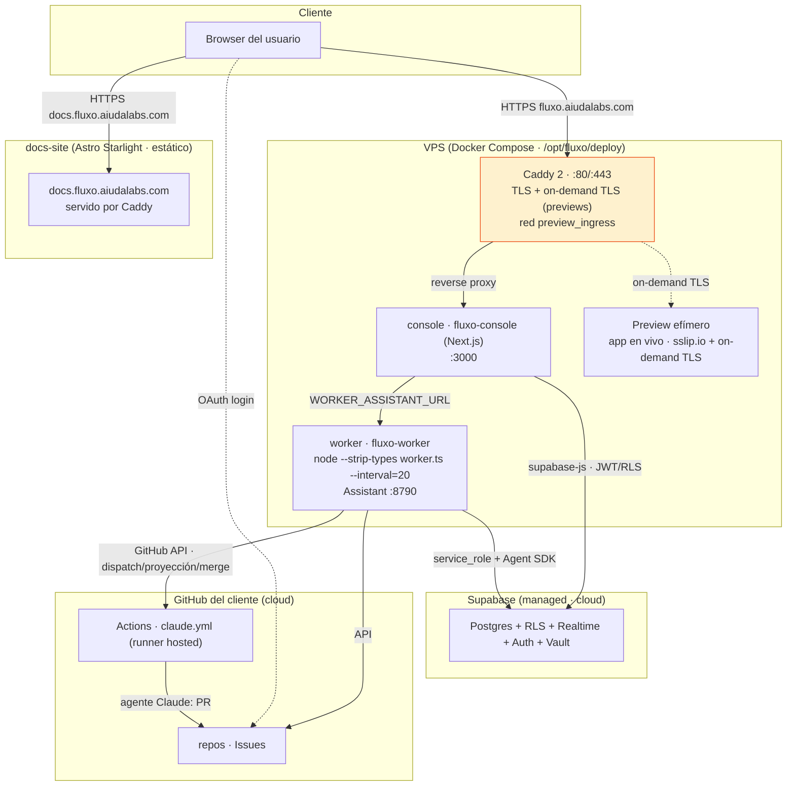

import { Aside } from '@astrojs/starlight/components';

Cómo se **despliega** Fluxo hoy: un VPS con Docker Compose detrás de Caddy, el sustrato en Supabase
managed, y el plano BUILD en la infraestructura del cliente. El compute pesado (los agentes de build)
**no vive acá** — vive en las Actions del cliente.

## El diagrama

## Detalle del despliegue

| Contenedor / servicio | Imagen / comando | Puerto | Rol |
|---|---|---|---|
| **caddy** | `caddy:2-alpine` | 80 / 443 | TLS + reverse proxy al console; **on-demand TLS** para los previews; red `preview_ingress`. |
| **console** | `fluxo-console` (Next.js) | 3000 | La UI. Habla con el worker por `WORKER_ASSISTANT_URL` (co-piloto) y con Supabase por RLS. |
| **worker** | `fluxo-worker` · `node --experimental-strip-types src/worker.ts --interval=20` | 8790 | Los reconcilers (tick 20s) + el Assistant HTTP. |
| **Supabase** | Managed (cloud) | — | Postgres + RLS + Realtime + Auth + Vault. Migraciones en `supabase/migrations/`. |
| **GitHub del cliente** | Actions (runner hosted) | — | El plano BUILD. Límite duro: **6 h por job** en runners hosted. |
| **docs-site** | Astro Starlight (estático) | — | Esta documentación, servida por Caddy en `docs.fluxo.aiudalabs.com`. |

<Aside type="note" title="BYO / cero-COGS">
Los agentes de **build** corren en las Actions del cliente con su propio token — el compute pesado y su
costo son del cliente, no de la plataforma. El VPS solo hostea el console, el worker (diseño + orquestación)
y el proxy. Un runner **self-hosted** daría log en vivo y quitaría el límite de 6 h, pero rompería el
modelo BYO/cero-COGS.
</Aside>

<Aside type="tip" title="Deploy">
El deploy es por `rsync` del código al VPS + `docker compose --env-file .env.prod -f docker-compose.prod.yml
up -d --build console worker`. El docs-site se buildea (`astro build`) y su salida estática la sirve Caddy.
</Aside>
