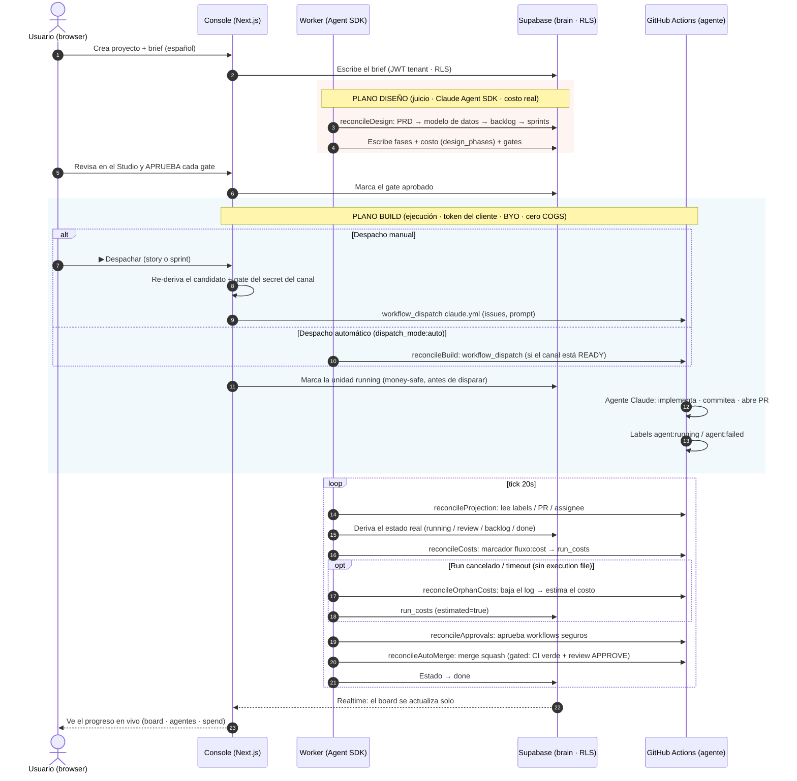

import { Aside } from '@astrojs/starlight/components';

Este es el recorrido completo de una unidad de trabajo: del **brief** en español a un **PR mergeado** en
el repo del cliente. Muestra los dos planos en el tiempo y dónde caen los **gates** (aprobación humana) y
los ganchos de **costo** y **estado**.

## El diagrama

## Notas del flujo

- **Los gates son humanos.** El worker no avanza un sprint que no fue aprobado en el Studio; el despacho
  no dispara si el canal de build no está READY (secret presente). El humano clickea; el kernel
  **re-deriva** la verdad server-side — nunca confía en el cliente.
- **Money-safe.** La unidad se marca `running` **antes** de disparar la Action → sale del set
  despachable, nunca hay doble-run pago. Pasado el punto de no retorno, un fallo no revierte
  (revertir re-despacharía).
- **La proyección deriva de GitHub.** El estado en el brain no se "escribe a mano": se deriva de los
  labels/PR/assignee que la Action deja. Un `agent:failed` degrada la story a `backlog` al toque.
- **El costo nunca miente.** Los runs que terminan dejan un marcador `fluxo:cost`; los cancelados/timeout
  se estiman del log del run (tokens del stream-json × tabla de precios) y se marcan `estimated`.

<Aside type="caution" title="El plano BUILD cuesta plata">
Cada `workflow_dispatch` dispara un agente Claude real en las Actions del cliente. Por eso todo el camino
de despacho es determinista y gateado: identidad, aislamiento (RLS), máquina de estados y ruteo son
código/config; solo el diseño, el código y la verificación de juicio son agentes.
</Aside>
