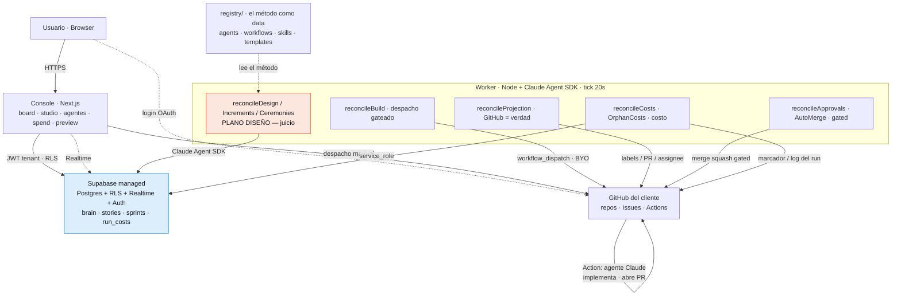

import { Aside } from '@astrojs/starlight/components';

Esta es la arquitectura **tal como está construida hoy**, no el diseño aspiracional. La tesis de Fluxo:
**alquilar el sustrato determinista** (Postgres + RLS + Realtime + Auth, y GitHub Actions) como
configuración, y dejar como código propio **solo el método** — que vive como *data* en el `registry/` —
más un pegamento fino. Todo el resto es orquestación sobre piezas alquiladas.

## Los dos planos

Fluxo separa el trabajo en dos planos con responsabilidades distintas:

- **Plano DISEÑO (juicio).** Corre en la plataforma de AIuda Labs: el **worker** usa el **Claude Agent
  SDK** para convertir el brief en PRD → modelo de datos → backlog gateado → sprints. Su salida vive en
  el *brain* (Supabase). Acá se paga el costo del diseño (`design_phases`).
- **Plano BUILD (ejecución).** Corre en el **GitHub del propio cliente**: cada unidad se despacha a una
  GitHub Action (`claude.yml`) que dispara un agente Claude con el **token del cliente (BYO)** — cero
  COGS para la plataforma. El agente implementa, commitea y abre un PR.

El **console** (Next.js) es la vista sobre el brain: board, studio, agentes, spend, preview. No decide
nada crítico — solo lee (RLS) y dispara acciones que el worker/kernel re-derivan server-side.

## El diagrama

<Aside type="tip" title="Regla de oro">
Cero metodología en código. El motor (`design/`, `control/`) es genérico y data-driven; **nunca** hay un
`if step.id == …` ni una persona/PRD/jerarquía de backlog hardcodeada. Todo eso vive en `registry/`.
</Aside>

## Piezas y responsabilidades

| Pieza | Qué es | Responsabilidad |
|---|---|---|
| **Console** (`console/`) | Next.js sobre Supabase (RLS + Realtime) | Vista del brain: board, studio+gates, agentes, spend, preview. Dispara despacho/stop; nunca deriva estado crítico. |
| **Worker** (`design/`) | Node + Claude Agent SDK, tick cada 20s | Diseño (SDK), proyección, despacho gateado, aprobaciones, auto-merge, costos. Sirve el Assistant en `:8790`. |
| **registry/** | YAML + markdown | El **método**: agents, skills, workflows, templates, stacks, providers. Sumar un engine o CLI = data, cero Go. |
| **Supabase** | Managed (Postgres+RLS+Realtime+Auth+Vault) | El **sustrato alquilado**: aislamiento multi-tenant por RLS en un solo lugar; el brain auditable. |
| **GitHub del cliente** | repos · Issues · Actions | El plano BUILD: ejecuta a los agentes con el token del cliente (BYO, cero COGS). |

Para el detalle del flujo temporal, ver **[Secuencia end-to-end](/arquitectura/secuencia-e2e/)**; para
cómo se despliega todo esto, **[Despliegue](/arquitectura/despliegue/)**.
