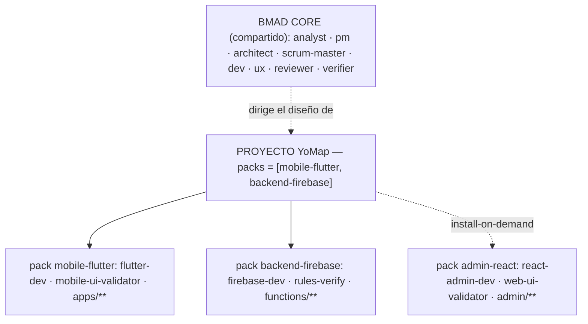
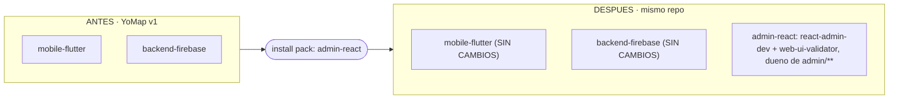
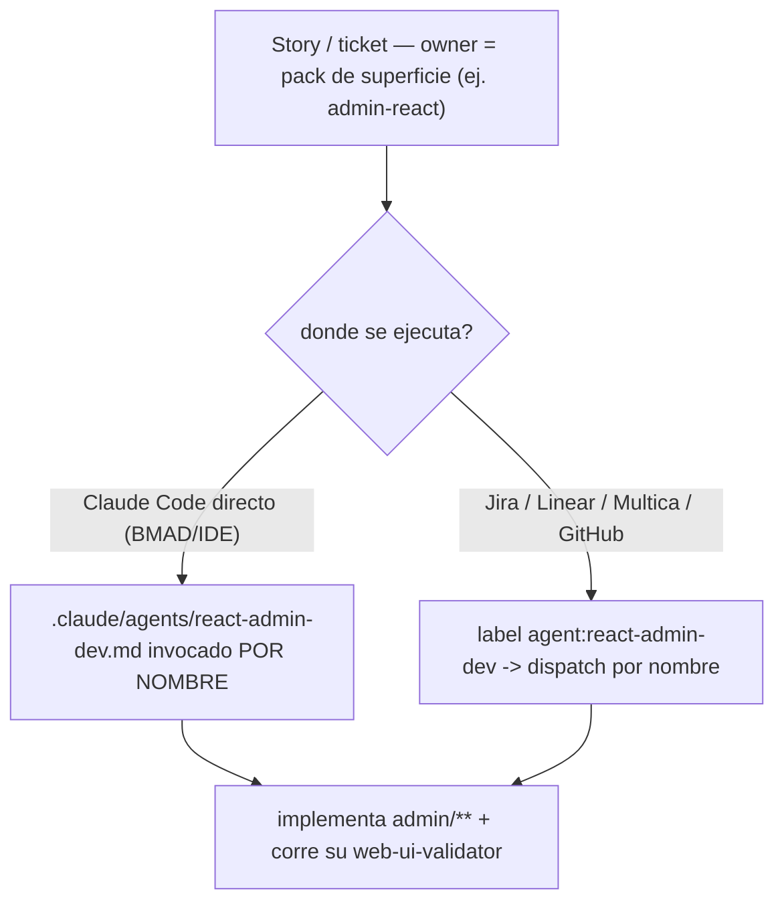

# 18 · Stacks como packs de superficie (alineado a BMAD)

> **Estado:** documento de diseño / decisión de arquitectura. Origen: sesión donde intentamos diseñar
> YoMap (Flutter+Firebase) en Fluxo y aparecieron gaps del concepto "stack". Acompaña al artifact visual
> homónimo. **No implementado todavía** — es la base para decidir e implementar.

## TL;DR

El "stack" monolítico se rompe con proyectos **multi-superficie** (mobile + admin-web + backend) y con
**cambios a mitad de camino** (empezás mobile+backend y después sumás un admin portal). La salida no es
inventar un concepto propio: **Fluxo es BMAD + orquestación**, y BMAD ya tiene el mecanismo para esto — el
**expansion pack**.

- El primitivo correcto es el **pack de superficie**, no el stack. Cada pack es autocontenido:
  `{ dev-agent · validador · template/scaffold · paths · knowledge }`.
- Un **proyecto compone** un set de packs. Un **stack** pasa a ser un **preset** (un bundle de packs).
- El **core de BMAD** (analyst, pm, architect, scrum-master, dev, ux, reviewer, verifier) queda lean y
  compartido; lo stack-específico vive en packs.
- **Agregar una superficie a mitad = instalar un pack** (install-on-demand de BMAD), sin tocar los otros.
- Fluxo **ya rutea por `owner`** de la story — exactamente como recomiendan Claude Code/Anthropic. No se
  reconstruye el motor; se hace el stack componible.

---

## 1 · Fluxo = BMAD core + orquestación

Los agentes de la fase de diseño de Fluxo (`analyst → pm → architect → scrum-master → dev → qa`) **son los
agentes core de BMAD**. BMAD es *document-first + handoffs humanos* y deja fuera priorización, ejecución,
testing y review. **Eso que BMAD deja afuera es lo que Fluxo construyó**: el engine, los gates, el dispatch,
el brain. Encajan como pieza y contrapieza.

**Implicación:** no hay que inventar un modelo de extensión — BMAD ya tiene uno maduro y con ecosistema (el
**expansion pack / module**). Alinearse a él es mejor que forkear del estándar.

## 2 · Qué dice la práctica oficial (Claude Code / Anthropic)

| Pregunta | Guía oficial | Implica para Fluxo |
|---|---|---|
| ¿Cómo se rutea a un agente? | Por `description` (auto) o **por nombre explícito**. Para dispatch automatizado desde tickets: **encodeá el owner e invocá por nombre** — no confíes en el match automático. | El `owner` de la story = la superficie = la clave de ruteo. **Ya lo hace.** |
| ¿Multi-superficie? | Un **agente separado por superficie**, tools restringidas, paths en su description. | Superficie = {agente + paths}. Encaja. |
| ¿Se agregan agentes con el tiempo? | No son estáticos. Agregar superficie = definir un agente nuevo, deployarlo al lado, rutear los tickets nuevos a él. **Cero cambios a los existentes.** | Composición > monolito. = el caso del admin. |
| ¿Validadores? | Un **reviewer/QA por dominio** (mobile-qa vs web-qa vs backend-security), read-only. No uno genérico. | El validador **viaja con la superficie**. Resuelve el "mockup mobile". |

Fuentes: [Claude Code subagents](https://code.claude.com/docs/en/sub-agents.md) ·
[agent teams](https://code.claude.com/docs/en/agent-teams.md) ·
[Agent SDK routing](https://code.claude.com/docs/en/agent-sdk/subagents.md) ·
[Anthropic: cuándo multi-agente](https://claude.com/blog/building-multi-agent-systems-when-and-how-to-use-them).

## 3 · El expansion pack de BMAD = la unidad de composición

El mecanismo de extensión de BMAD es el **expansion pack / module**: un bundle **autocontenido** de
`{ agents + templates + workflows + validadores + knowledge }`, **install-on-demand**, con el core lean. Un
proyecto puede usar **varios packs a la vez**. La "Surface" ≈ un BMAD pack a grano fino.

| Capa | Qué es | Ejemplos |
|---|---|---|
| **Core** (BMAD, lean, compartido) | agentes ágiles stack-agnósticos | analyst, pm, architect, scrum-master, dev, ux, reviewer, verifier |
| **Packs de superficie** (stack-específicos) | autocontenido: `dev-agent + validador + template + paths + knowledge` | `mobile-flutter`, `backend-firebase`, `admin-react`, `backend-supabase`, `backend-python`, `web-react` |
| **Stack** | un **preset** que instala un set de packs | `aiuda-flutter-firebase = [mobile-flutter, backend-firebase]` |

## 4 · Anatomía de un pack de superficie

```yaml
# registry/packs/mobile-flutter/pack.yaml   (BMAD-style, autocontenido)
id: mobile-flutter
label: App móvil (Flutter)
kind: frontend            # frontend | backend
platform: mobile          # dirige encuadre de UI + mockups (phone frame)
dev_agent: flutter-dev
ui_validator: mobile-ui-validator   # el validador VIAJA con el pack
paths: [ "apps/**", "packages/**" ]
scaffold: templates/mobile-flutter/
knowledge: [ flutter-idioms.md ]    # riverpod, go_router, widget tests
capabilities: [ ]
# backend-firebase → firebase-dev, rules-verify, functions/**, capabilities:[firebase]
# backend-supabase → supabase-dev (NUEVO), rules-verify, supabase/**
# admin-react      → react-admin-dev, web-ui-validator, admin/**
```



## 5 · Los 4 escenarios (mismo modelo, distinta composición)

| Escenario | Packs | Agentes · validadores |
|---|---|---|
| **A · Web sola** (React+Supabase) | web-react · backend-supabase | react-web-dev + web-ui-validator · supabase-dev + rules-verify |
| **B · YoMap** (mobile+Firebase) | mobile-flutter · backend-firebase | flutter-dev + mobile-ui-validator · firebase-dev + rules-verify |
| **C · YoMap + admin** *(cambia a mitad)* | mobile-flutter · backend-firebase · **+admin-react** | … los 2 de arriba (sin cambios) · **+ react-admin-dev + web-ui-validator** |
| **D · API** (FastAPI+React) | backend-python · web-react | python-dev + api-verify · react-web-dev + web-ui-validator |

El modelo **no cambia** entre escenarios — solo el *set* de packs. El validador de UI es distinto por
superficie: `mobile-ui-validator` (phone frame, compara vs mockup mobile) vs `web-ui-validator` (browser).
Eso resuelve el "mockups que no encajan en mobile".

## 6 · El caso clave: instalar el pack admin a mitad



Los 5 pasos (data/aditivos):
1. Agregás `admin-react` a `settings.packs` del proyecto (install-on-demand).
2. Fluxo **re-scaffoldea aditivo**: siembra `admin/**` + suma `react-admin-dev` y `web-ui-validator` al
   roster (AGENTS.md / `.claude/agents`).
3. El **scrum-master** (que conoce los packs instalados) emite las stories del admin con `owner: admin-react`.
4. El **dispatch** rutea `owner → react-admin-dev`; su gate visual usa el **web-ui-validator** (viaja con el pack).
5. **mobile-flutter** y **backend-firebase**: **cero cambios.**

Es literal la guía oficial + el install-on-demand de BMAD.

## 7 · Ruteo: el mismo modelo en los dos modos



La superficie es la **clave de ruteo**; solo cambia quién dispara (Claude Code directo, o un tracker como
**Multica**/Jira/Linear). Fluxo ya lo hace con el `owner`.

## 8 · Los 3 modelos, comparados adversarialmente

| Modelo | Idea | Multi-superficie | Cambio a mitad | Veredicto |
|---|---|---|---|---|
| **A · Stack monolítico** (hoy) | un id → lanes fijas | ❌ rompe | ❌ rompe | Status quo, probado roto. |
| **B · Packs de superficie** (BMAD) | proyecto = set de packs; stacks = presets | ✅ nativo | ✅ aditivo | **Recomendado.** Presets=velocidad; packs=flexibilidad; ecosistema BMAD. |
| **C · Lane-graph puro** | sin presets; lanes crudas + deps | ✅ sí | ✅ sí | Máxima flexibilidad, sin guardrails. Overkill hoy. |

## 9 · Antes de implementar: 3 arreglos de base

Los destapó la eval adversarial — hoy 2 de 3 stacks están rotos. El modelo de packs los **disuelve solo**,
porque cada pack trae su propio agente+validador correcto:

1. **`supabase-dev` no existe** pero el template react-supabase lo nombra dueño de `supabase/**` → el pack
   `backend-supabase` **lo crea**.
2. **`react-dev` está flavor-eado a Firebase** (admin de flutter-firebase). Se **separa**: pack `admin-react`
   (react-admin-dev, Firebase) vs pack `web-react` (react-web-dev, genérico/Supabase). Cada pack su react correcto.
3. **Timing de `auto`:** el set de packs debe estar resuelto **antes** de data-modeler/ux/designer. Se ancla
   en la **Constitución** (fase 2, que ya recibe el stack) machine-readable, y las fases posteriores lo leen
   de ahí — no del `$trigger` estático.

## 10 · Ruta de migración (desde `feat/stacks-visible`)

La rama `feat/stacks-visible` (selector + registry filtrable por stack + fail-loud por `registry/stacks`)
quedó implementada y verde (278/278). Se **reencuadra** así, sin tirarla:

1. Los "stacks" que ya lista pasan a ser **presets de packs**; el selector elige un preset o packs sueltos.
2. **Empaquetar** lo stack-específico de `registry/` en `registry/packs/<id>/` (agent + validador + template +
   knowledge). El core (analyst/pm/…) queda en `registry/agents/`.
3. **Crear** los packs faltantes/mal: `backend-supabase` (con supabase-dev), `admin-react` vs `web-react`.
4. **Fluir por pack** lo stack-shaped a las fases de diseño: `platform`→ux/designer, `backend`→data-modeler,
   `dev_agent`→owner del scrum-master. Resuelto post-constitución.
5. **Validadores por superficie** en el ui-verify: mobile-ui-validator vs web-ui-validator, elegidos por el
   pack de la story.

## 11 · Glosario

| Término | Qué es |
|---|---|
| **Core (BMAD)** | los agentes ágiles compartidos, stack-agnósticos (analyst, pm, architect, scrum-master, dev, ux, reviewer, verifier). |
| **Pack de superficie** | un BMAD expansion pack autocontenido: `dev-agent + validador + template + paths + knowledge`. Uno por superficie. |
| **Stack** | un preset con nombre = un set de packs para arrancar rápido. |
| **owner / lane** | el campo de la story/ticket que nombra el pack → clave de ruteo (dispatch por nombre). |
| **Validador** | el reviewer/QA de una superficie (mobile-ui-validator, web-ui-validator, rules-verify). Viaja con el pack. |

---

## Decisiones abiertas

- **¿Grano del pack?** Un pack por superficie (recomendado) vs un pack por combo-stack. El fino compone mejor.
- **¿`registry/packs/` como layout?** Confirmar contra el schema real de BMAD modules/expansion-packs al implementar.
- **Gap de medio en ui-verify:** aun con `platform: mobile`, el mockup HTML vs screenshot Flutter difiere en
  render — decidir la tolerancia del `web/mobile-ui-validator` (fidelidad de estructura, no pixel-perfect).

## Fuentes

- Claude Code / Anthropic: [subagents](https://code.claude.com/docs/en/sub-agents.md),
  [agent teams](https://code.claude.com/docs/en/agent-teams.md),
  [Agent SDK subagents](https://code.claude.com/docs/en/agent-sdk/subagents.md),
  [cuándo multi-agente](https://claude.com/blog/building-multi-agent-systems-when-and-how-to-use-them),
  [multi-agent research system](https://www.anthropic.com/engineering/built-multi-agent-research-system).
- BMAD: [core architecture (DeepWiki)](https://deepwiki.com/bmad-code-org/BMAD-METHOD/1.1-architecture-overview),
  [expansion packs](https://medium.com/@visrow/bmad-method-universal-agent-framework-expansion-packs-that-transform-ai-into-any-domain-0a640a26bb81),
  [guía BMAD](https://www.augmentcode.com/guides/bmad-method-ai-development),
  [customize (modules/agents/skills)](https://docs.bmad-method.org/how-to/customize-bmad/).
- Monorepo multi-frontend: [frontend monorepo guide](https://feature-sliced.design/blog/frontend-monorepo-explained).
